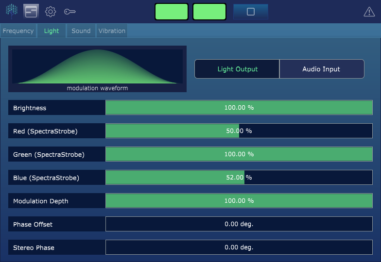

# SpectraStrobe
Information and resources for creating SpectraStrobe and AudioStrobe audio tracks.

### New Repository
Thanks for your interest in the SpectraStrobe information repository. This repository has been retired.

Please visit the new repository [here](https://docs.cymaticsomatics.com/docs/spectrastrobe).

### Prism
You can also check out [Prism](https://www.cymaticsomatics.com) which is a professional creation tool for Brain Wave Entrainment (BRE)
sessions that supports both AudioStrobe and SpectraStrobe light encoding.

